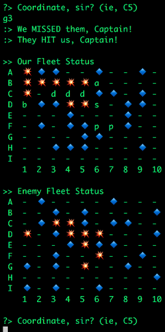

# Battleship ... in Rust.



This is the game of Battleship written in Rust.

I wrote this while trying to learn Rust, so pardon the nieve implementations.

I'll have a post up at https://ls3.io about the experience soon.

## Running the Game

You must have [Rust installed](https://www.rust-lang.org/en-US/install.html).

```bash
cargo build
cargo run
```

## Rules of Battleship

Board:

- horizontally by letters A through I
- vertically by numbers 1 through 10

Ships:

- Aircraft carrier: 5 spaces
- Battleship: 4 spaces
- Destroyer: 3 spaces
- Submarine: 3 spaces
- Patrol: 2 spaces

## Game Play

- When you start a game, the Ships are randomly placed on your board (and the computer's board).
- You get prompted for coordinated for your next torpedo.
- As you build up hits/misses, you start to hone in on the enemy ships.
- Sink all the ships to win the game.
