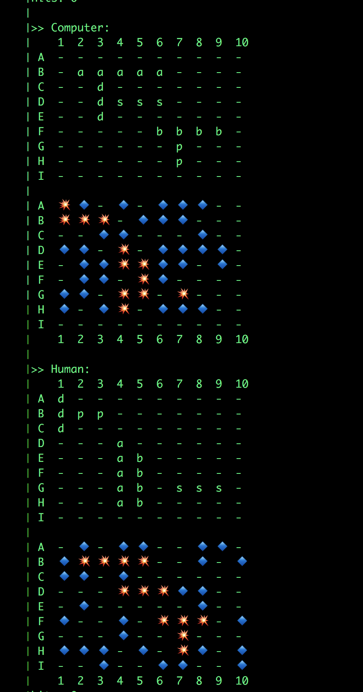

# Battleship ... in Rust.

This is the game of Battleship written in Rust.

**This is a (so far) incomplete implementation.**

I wrote this while trying to learn Rust, so pardon the nieve implementations.

I'll have a post up at https://ls3.io about the experience soon.

## Rules of Battleship

Grids:

- horizontally by letters A through I
- vertically by numbers 1 through 10

Ships:

- Aircraft carrier: 5 spaces
- Battleship: 4 spaces
- Destroyer: 3 spaces
- Submarine: 3 spaces
- Patrol: 2 spaces

## What is worked:

Well, when you start the game, it auto places your Ships on the board. :D

